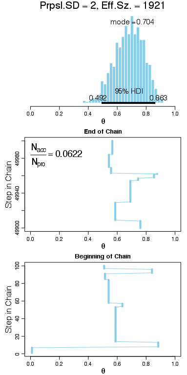

# Exercise 7.1

The following plots were produced by running `BernMetrop.R`.

This plot was generated using a relatively small standard deviation of 0.02 for the Gaussian proposal distribution. The effective sample size (ESS) is only 435 despite the fact that the Metropolis algorithm was run with 50,000 iterations. This suggests a high degree of autocorrelation in the chain.

This plot was generated using a relatively large standard deviation of 2. Once again, the ESS is quite small (1,921) compared to the trajectory length (50,000). This suggests a high degree of autocorrelation in the chain.

Finally, this plot was generated using a moderate standard deviation of 0.2. The ESS of 11,092 is much larger than those of the above runs. This choice of standard deviation produces the most efficient chain.

