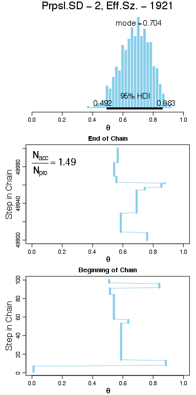

# Exercise 7.2

## (A)

The following plots were produced by running `Exercise-07-02.R`.

### Small standard deviation
The high degree of autocorrelation leads to a small ESS.
 

### Large standard deviation
Again, the high degree of autocorrelation leads to a small ESS.
 

### Medium standard deviation
In contrast, the low degree of autocorrelation leads to a large ESS.
 

## (B)

The plot for the large standard deviation above has a large number of points that fall along the identity line. This is because many of the proposed jumps are rejected, so the chain gets stuck at a single parameter value for several steps. If the chain remains in a single place for 10 or more steps, then at least one point will be added to the diagonal in the scatter plot.
