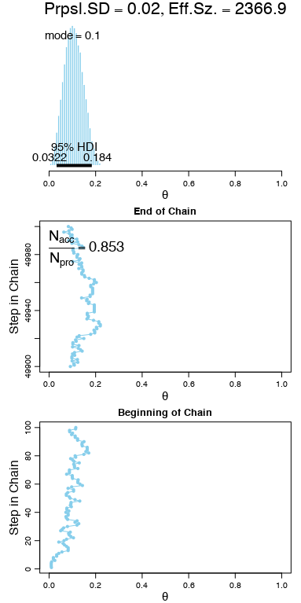

# Exercise 7.3

The following plots were produced by running `Exercise-07-03.R`.

## (B)

Here is a plot of the trimodal prior density.

 

## (C)

The MCMC sample is in fact representatitve of the prior.

## (D)

The data consists of one tail and two heads, so it makes sense that the posterior would be weighted toward 1. The Metropolis algorithm appears to be generating a representative sample of the posterior.

## (E)

The chain is unable to escape the peak near 0. The small standard deviation of 0.02 ensures that the proposed parameter value is always very close to the current value. This makes "jumps" to other modes of the distribution effectively impossible. Since steps to the right are less likely to be accepted than steps to the left, the chain never makes it beyond the right edge of the left peak. The resulting sample is a very poor representation of the posterior.

## (F)

Again, the small standard deviation traps the chain in one of the posterior distribution's modes. This time the chain gets stuck in the rightmost peak, since the starting value is close to 1. In conjunction with Part (E), this result tells us that neither of these last two samples is representative of the true posterior.

