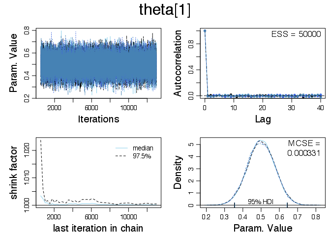
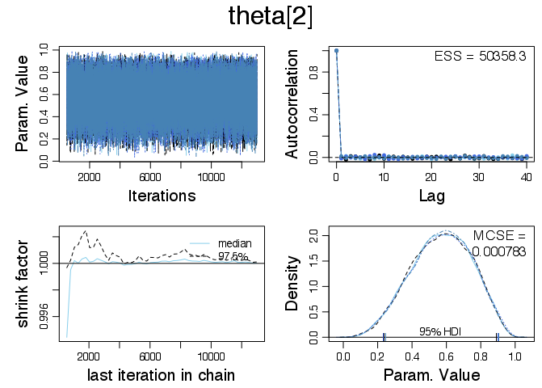
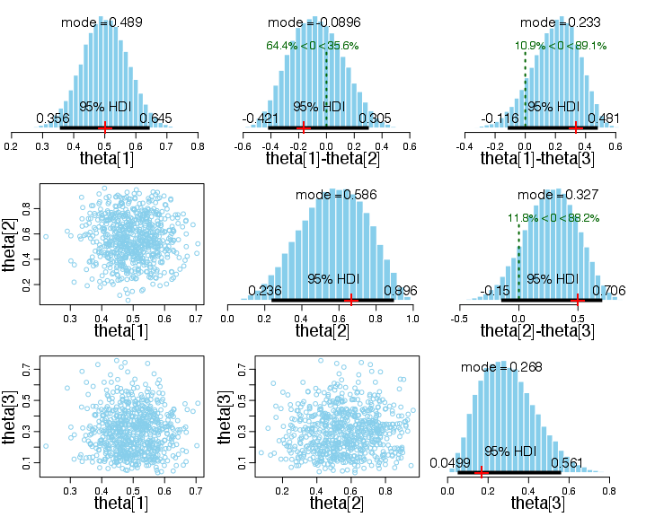

# Exercise 8.1

The data are stored in `Exercise-08-01.csv`. The following plots were generated by running `Exercise-08-01.R`.

## Diagnostic plots

The following diagnostic plots suggest that each of the three MCMC chains has converged and is representative.

## Posterior

The posterior estimates are reasonable. For theta[2] and theta[3], the posterior samples reflect the compromise between the slightly peaked beta(2,2) prior and the likelihood induced by the small sample size. The theta[1] posterior is narrower as a result of the larger sample size.

