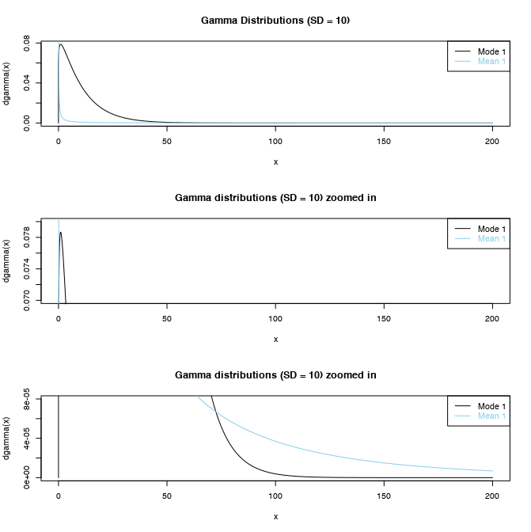
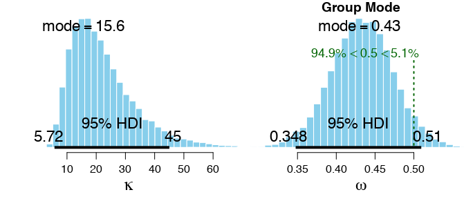
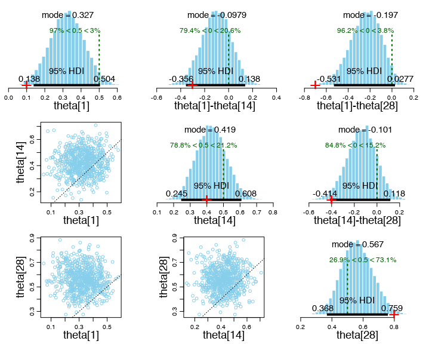
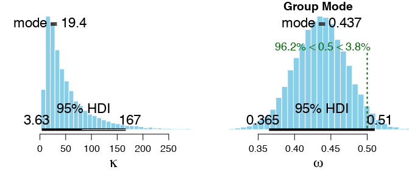
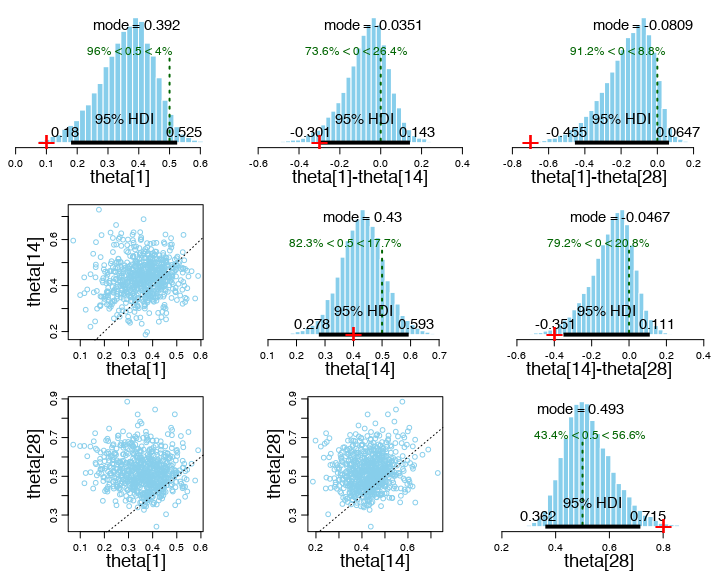

# Exercise 9.1

The following plots were produced by running `Exercise-09-01.R`.

## (A)

For a gamma distribution with mean 1.0 and s.d. 10.0, the shape and rate parameters are *s* = *r* = 0.1.

For a gamma distribution with **mode** 1.0 and s.d. 10.0, the shape parameter is *s* = 1.105 and the rate parameter is *r* = 0.105.

## (B)

This plot shows three different views of two gamma distributions, one with a mode of 1 and the other with a mean of 1.

 

The gamma distribution with a mode of 1 (in black) favors values of 𝜅 betwen about 0.1 and 75, whereas the gamma distribution with a mean of 1 (in blue) favors values of 𝜅 that are either very small or very large.

## (C)

Here are the posterior distributions for the gamma distribution with mode 1.

Here are the posterior distributions for the gamma distribution with mean 1.

## (D)

The marginal posterior distribution on 𝜅 has a much longer right-tail for the gamma prior with mean 1 rather than mode 1. When the concentration parameter 𝜅 is larger, the effect of shrinkage on the 𝜃 parameters is correspondingly greater. This is readily visible in the marginal posterior plots of theta[1] and theta[28] above.

## (E)

I think the gamma prior with mean 1 is more appropriate, because it allows for a wider range of credible values on 𝜅.