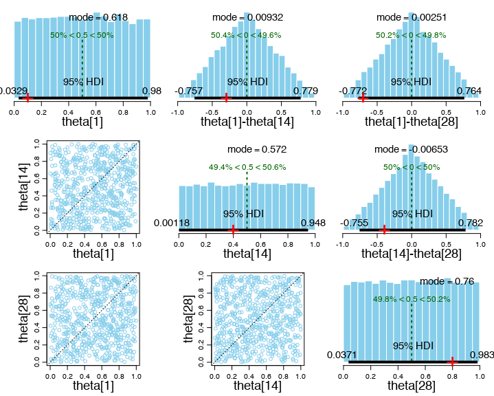
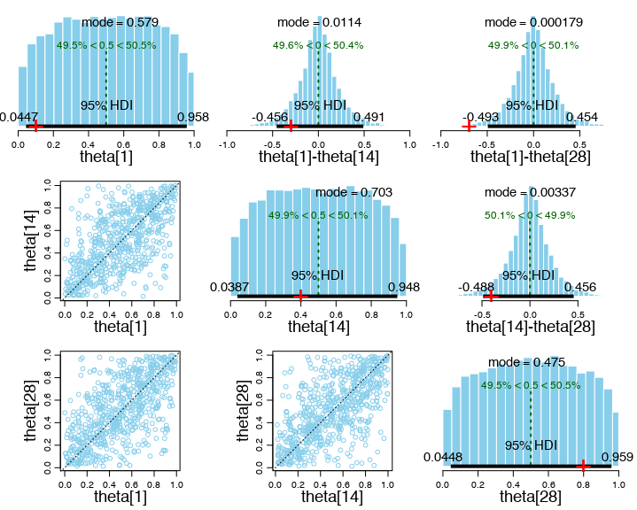

# Exercise 9.2

The following plots were produced by running `Exercise-09-02.R`.

These plots show the implied priors on the 𝜃 parameters when the gamma prior with **mean** 1 is used.

These plots show the implied priors on the 𝜃 parameters when the gamma prior with **mode** 1 is used.

## (A)

A uniform prior on theta is achieved when very small values for (𝜅 - 2) are allowed, because this in turn leads to a disitrubtion which is close to beta(1,1). The gamma prior with mean 1 places high probability density on values very close to zero. For a gamma prior with mode 1, on the other hand, the probability density vanishes at 0, and more mass is located between the values of roughly 0.1 and 75. This favors larger values for 𝜅, which pulls the resulting beta prior on the 𝜃 parameters away from uniformity.

## (B)

The gamma distribution with mean 1 is more appropriate because it results in uniform priors on the 𝜃 parameters. Since we have no reason to believe a priori that any particular value of 𝜃 is more credible than any other, a uniform prior is desirable.