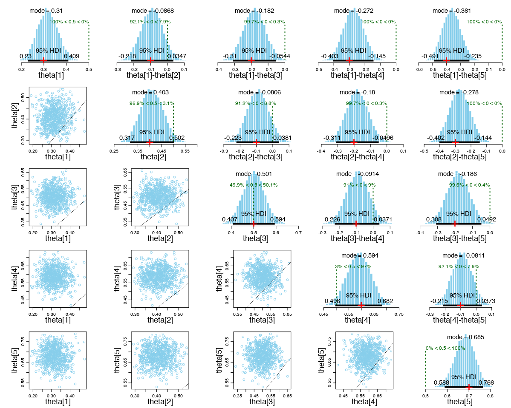
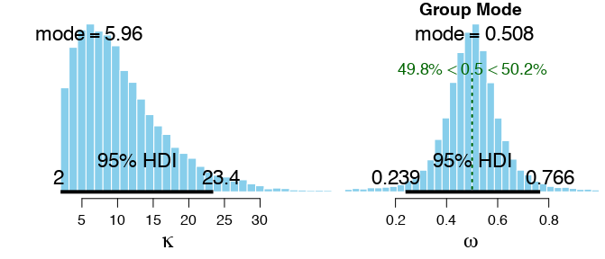

# Exercise 9.3

The code is in `Exercise-09-03.R`.

These plots on the diagonal of the figure below show the posterior distributions of the 𝜃 parameters.

There is a small amount of shrinkage, but less shrinkage than under maximum likelihood estimation. Indeed, the ML estimate for the concentration parameter 𝜅 was 15.8, whereas the MAP estimate is 5.96. This is because the mode 1 prior on 𝜅 emphasizes smaller values.

The Bayesian analysis provides an entire distribution on the joint parameter set, instead of the point estimates provided by the MLE method.