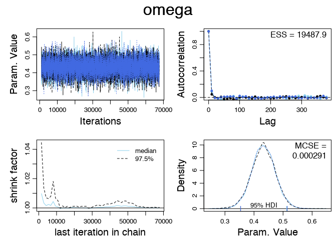
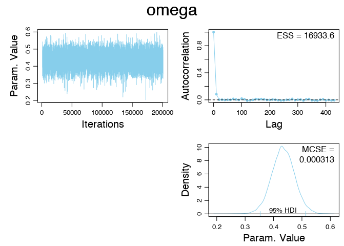

# Exercise 9.4

## (A)

See the code in `Exercise-09-04.R`.

## (B)

See the code in `Exercise-09-04.R`.

## (C)

The elapsed time for the parallel run was 12.3 seconds whereas that for the non-parallel run was 25.9 seconds. In other words, the parallel run was twice as fast. The ESS for the parallel chain was somewhat larger: 19,488 vs. 16,933.

### Parallel diagnostic plots

### Non-parallel diagnostic plots

