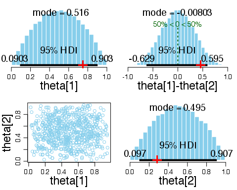
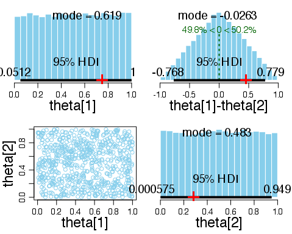
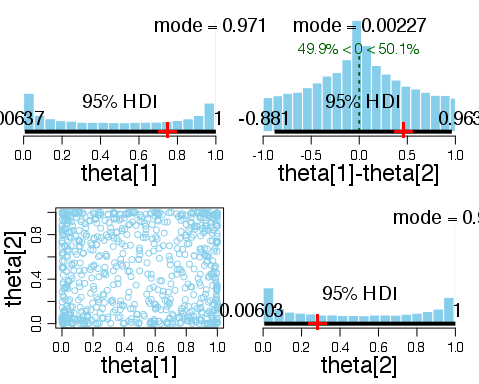

# Exercise 8.4

The following plots were produced by running `Exercise-08-04.R`.

## (A) 

## (B)

Beta(1,1) is the uniform distribution over [0,1].

## (C)

Beta(0.5,0.5) is peaked at 0 and 1, symmetric about 0.5.

